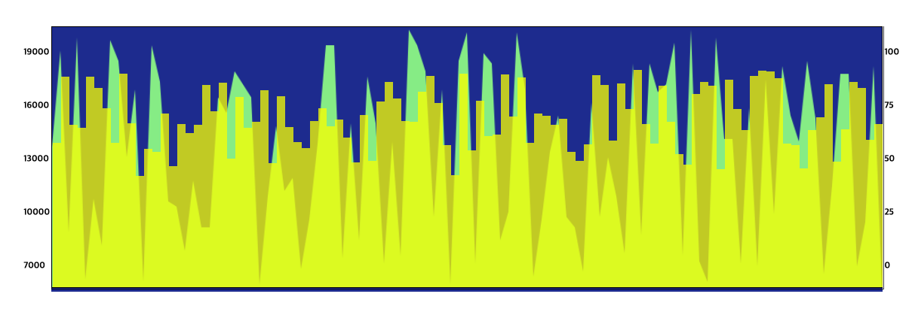
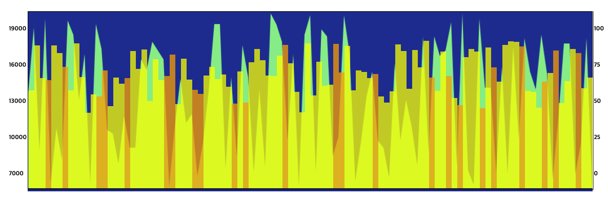
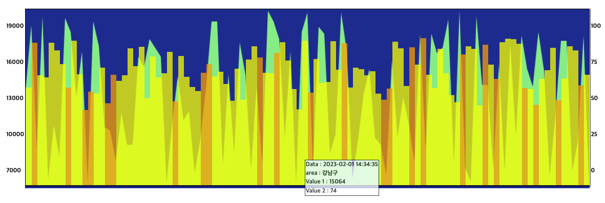

# MockData-Graph

---

## 목적

---

1. 백엔드가 개발이 되어 있지 않다는 가정하에 API 요청 시 mock 데이터를 기반으로 개발 진행

---

## 진행기간

2023/09/10 ~ 2023/09/13

---

## 요구 사항

---

1. 주어진 데이터를 기반으로 시계열 차트 만들기
2. 시계열 차트 만들기
3. 호버 기능 구현
4. 필터링 기능 구현
  click과 hover에 적용

---

## 실행방법

```shell
git clone https://github.com/thumbthing/mockdata-seoul-area.git
&& npm install 
&& npm start

```

---

## 기능

---

### 1. Mock Data  

```javascript
export const getData = async () => {
  try {
    const response = await httpInstance.get('/graph');
    if (response?.status !== 200) {
      throw new Error('fail to get data from server.....');
    }
    return response;
  } catch (error) {
    errorHandler(error);
    return null;
  }
};
```

```javascript
// mock server 라이브러리 세팅
 "dependencies": {
    ...
    "msw": "^1.3.0",
    ...
 }

 // url 요청을 브라우저 mock 서버로 가로 채서 가상의 Promise를 반환

 const handlers = [
  rest.get('http://localhost:4000/graph', (req, res, ctx) => {
    const data = mockData;

    return res(ctx.status(200), ctx.json(data));
  }),
];
```

1. 실제로 적용할 기능을 구현  
2. 라이브러리 세팅하여 브라우저내에서 mock 서버 구동
3. url 요청을 중간에 가로채서 mock server에 세팅한 data 반환하여 가상의 백앤드 환경 구축
4. 배포를 위해서 의도적인 getData 요청의 에러를 발생 시킨 후 프로젝트 내부의 .json 데이터를 반환  

---

#### 구현 의도

1. 서버 개발이 완료되지 않은 상황에서 개발을 진행하는 시나리오로 프로젝트를 진행
2. 서버로 요청될 실제 url requset를 mock 서버로 intercept하여 가상의 요청의 성공/데이터 반환해서 BackEnd 기능 개발이 완료 되었을때 mock 세팅만 삭제하여 개발 세팅 최소화
3. 관심사 분리를 통해 기능들을 모듈화하여 실제 서버에 적용시 각각의 기능들의 최소한의 수정만 하면 기능 작동 하도록 설계

---

### 2. State 관리 

```javascript

const defaultState: StateType = {
  GraphData: [],
  SelectedDataKey: '',
  SelectedDataValue: {
    timestamp: '',
    id: '',
    value_area: 0,
    value_bar: 0,
  },
};

const StateContext = createContext<
  { state: StateType; setState: React.Dispatch<React.SetStateAction<StateType>> } | undefined
>(undefined);

export const MockContext = () => {
  const context = useContext(StateContext);
  if (!context) {
    throw new Error('useMock must be used within a MockProvider');
  }
  return context;
};

export function MockProvider({ children }: { children: ReactNode }) {
  const [state, setState] = useState<StateType>(defaultState);
  const memorizedState = useMemo(() => ({ state, setState }), [state]);

  return <StateContext.Provider value={memorizedState}>{children}</StateContext.Provider>;
}

```

1. 공통적으로 사용할 State 선별하여 Context API를 사용하여 관리

---

#### 구현 의도

1. 부모 컴포넌트에서 부터 발생할 `Props Drilling`을 최대한 방지
2. 서버 요청으로 응답 받은 데이터를 활용하여 생성해야할 그래프들에 사용될 state의 중복 작성을 방지

---

### 3. Graph

#### 3-1 첫페이지



1. Bar Graph
  mock data로 각각의 item을 생성
  생성된 li들을 가로로 배치

2. Area Graph
  Canvas 태그 사용
  응답받은 mock data로 x, y 축 계산 후 렌더링

---
기술 선택 이유

- 라이브러리를 활용하여 구현한 팀원들이 대부분이어서 초기에는 라이브러리 활용하여 구현 했지만
라이브러리로 구현한 컴포넌트의 커스터마이징(동일 id hover effect, click event) 시도 했을때 많은 제약 사항이 있었습니다. x, y 좌표값을 구할 수 있으면 Canvas 태그로 area Graph를 그릴 수 있을 것 같아서 mock data를 파싱하여 생성.
  하지만 생산성이나 디자인 측면에서 보면 이렇게 직접 그려서 그래프를 보여주는 것 보다는 라이브러리 활용이 좀더 효율적 이라는 것을 경험

#### 3-2 hover evnet



1. mock data list 내에 존재하는 area id 값이 동일한 bar graph의 색상을 변경

---

#### 3-3 click event



1. 특정 bar gragph 클릭시 상세 설명 컴포넌트 생성

---
구현 이유

1. 과제 요청 사항은 hover event 와 동일한 기능을 요구 했지만 이미 mouseEnter 이벤트가 click 전에 동작하여 의미가 없다고 판단
2. 기존 필터링 기능에서 추가로 그래프의 상세 데이터를 보여주는 기능을 추가하면 click 이벤트 구현 여부를 확인 가능하다고 판단하여 기능 추가


## 프로젝트 구조

---

```shell

├── App.test.tsx
├── App.tsx
├── api
│   ├── apiService.ts
│   └── httpInstance.ts
├── components
│   ├── AxisBar.tsx
│   ├── CanvasChart.tsx
│   ├── DetailBarInformation.tsx
│   ├── Loading.tsx
│   ├── ValueBar.tsx
│   └── ValueList.tsx
├── context
│   ├── Service.context.tsx
│   └── State.Context.tsx
├── hooks
├── index.tsx
├── mocks
│   ├── browser.ts
│   ├── handlers.ts
│   └── mockData.json
├── pages
│   ├── Error.Page.tsx
│   └── Graph.Page.tsx
├── react-app-env.d.ts
├── reportWebVitals.ts
├── routes
│   ├── Router.tsx
│   └── routePath.ts
├── service
│   └── getData.ts
├── setupTests.ts
├── styles
│   ├── AxisBar.style.ts
│   ├── Canvas.style.ts
│   ├── Container.style.ts
│   ├── DetailBarInformation.style.ts
│   ├── Error.page.style.ts
│   ├── Loading.style.ts
│   ├── ValueBar.style.ts
│   └── ValueList.style.ts
├── types
│   ├── axisBar.type.ts
│   ├── json.type.ts
│   ├── mouseLocation.type.ts
│   ├── service.type.ts
│   └── state.type.ts
└── utils
    ├── dataParser.ts
    ├── errorHandler.ts
    └── filterData.ts

```

---

### 사용 라이브러리

---


```javascript
dependecies: {
   "axios": "^1.5.0", // http 요청
    "msw": "^1.3.0", // mock server 구축
    "styled-components": "^6.0.7", // css-in-js 라이브러리
}

```

---

## Commit Convertion

| Type 키워드 | 사용 시점                                                             |
| ----------- | --------------------------------------------------------------------- |
| Feat        | 새로운 기능 추가                                                      |
| Fix         | 버그 수정                                                             |
| Docs        | 문서 수정                                                             |
| Style       | 코드 스타일 변경 (코드 포매팅, 세미콜론 누락 등)기능 수정이 없는 경우 |
| Design      | 사용자 UI 디자인 변경 (CSS 등)                                        |
| Test        | 테스트 코드, 리팩토링 테스트 코드 추가                                |
| Refactor    | 코드 리팩토링                                                         |
| Build       | 빌드 파일 수정                                                        |
| Ci          | CI 설정 파일 수정                                                     |
| Chore       | 빌드 업무 수정, 패키지 매니저 수정 (gitignore 수정 등)                |
| Rename      | 파일 혹은 폴더명을 수정만 한 경우                                     |
| Remove      | 파일을 삭제만 한 경우                                                 |

